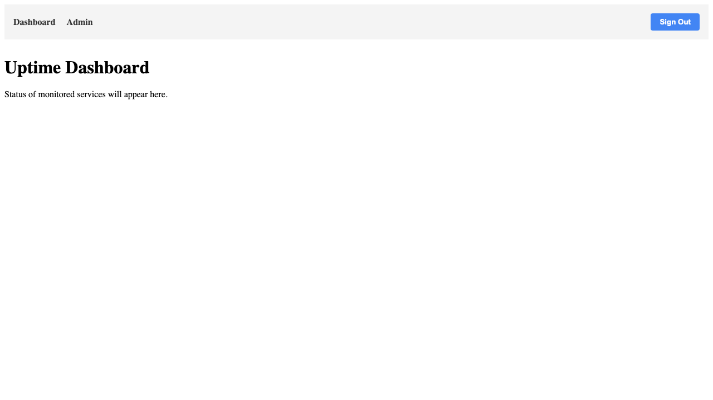

# Authentication

Verifies the authentication flow, including sign-in and protected route access.

## Test Steps

### 01-auth-wall

**Description:** Unauthenticated user sees the Auth Wall

**Verifications:**
- Auth Wall heading is visible
- Sign-in prompt text is visible
- Sign-in button is visible

---

### 02-authenticated-dashboard

**Description:** Authenticated user sees the Dashboard and Navigation

**Verifications:**
- Auth Window is gone
- Nav is visible
- Dashboard link is visible
- Admin link is visible
- URL is /dashboard

---

