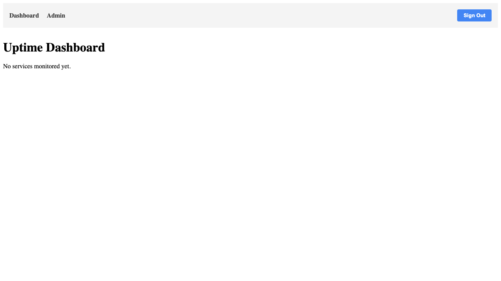
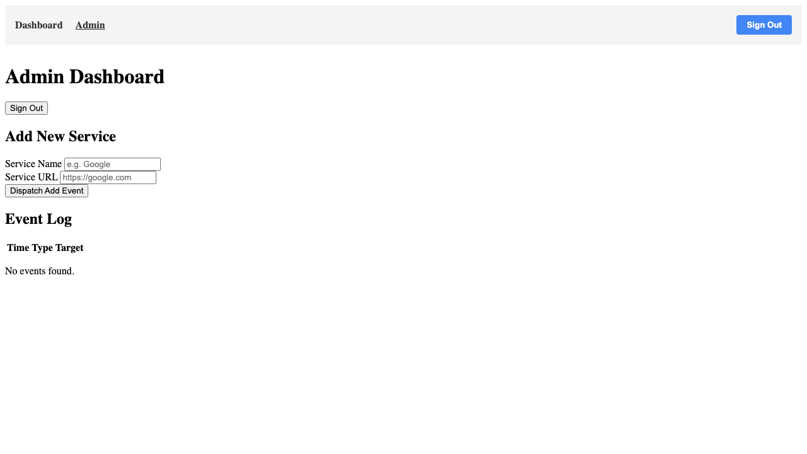

# Authentication

Verifies authentication, private routing, provenance, and administrator access control.

## Test Steps

### 01-auth-wall

**Description:** Unauthenticated users see the authentication wall.

**Verifications:**
- Authentication heading is visible
- Sign-in prompt is visible
- Sign-in button is visible

---

### 02-authenticated-dashboard

**Description:** Authenticated users are redirected to the private dashboard and can see component provenance.

**Verifications:**
- Primary navigation is visible
- Dashboard link is visible
- Admin link is visible
- URL is /dashboard
- All component versions are reported

---

### 03-admin-page

**Description:** An authenticated non-admin is denied administrator controls.

**Verifications:**
- Admin page loads
- Administrator access is required
- URL is /admin

---

