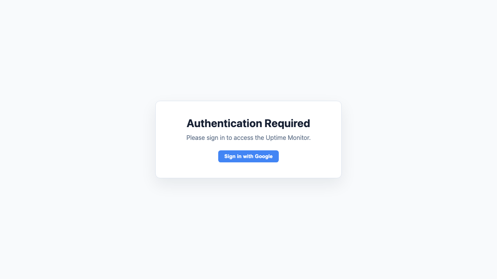
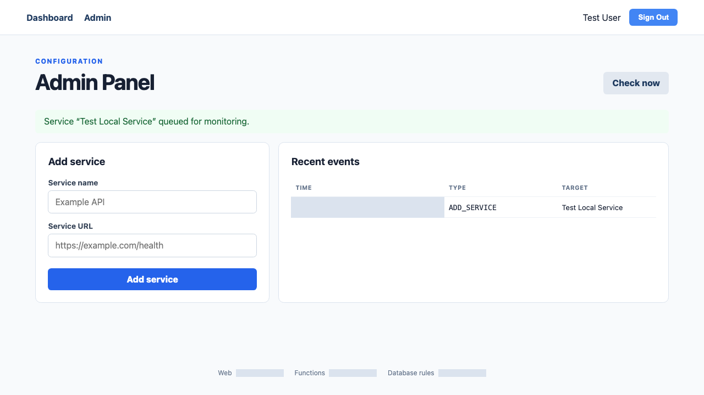
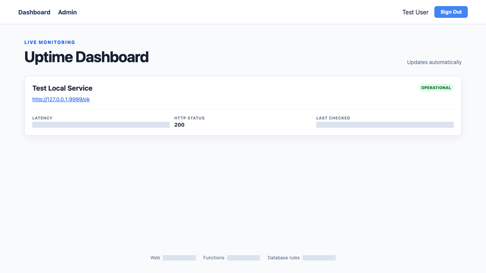

# MVP Journey

Verifies the private workflow from an administrator event through service projection and an authenticated monitor check.

## Test Steps

### Navigate to Home

**Description:** Load the private application while signed out.

**Verifications:**
- Authentication is required

---

### Login and Seed Admin

**Description:** Sign in through the Auth emulator and grant the test user administrator access.

**Verifications:**
- User is signed in
- Component provenance is available

---

### Admin Add Service

**Description:** Dispatch an ADD_SERVICE event from the administrator UI.

**Verifications:**
- Success message is visible
- Event log contains ADD_SERVICE
- Event log contains the service

---

### Verify Service Processing

**Description:** Verify the database-triggered Function projects the event into services.

**Verifications:**
- Projected service exists

---

### Trigger Monitor

**Description:** Run the protected manual monitor endpoint as the administrator.

**Verifications:**
- Monitor records an operational status

---

### Verify Dashboard Status

**Description:** Display the monitored service and its current status on the private dashboard.

**Verifications:**
- Service is visible
- Status is operational
- HTTP status is displayed

---

